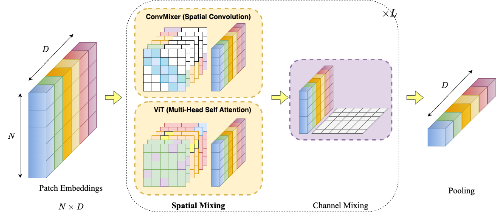

# Convolutional Initialization for Data-Efficient Vision Transformers
### [Project Page](https://osiriszjq.github.io/impulse_init) | [Paper]()
[](https://opensource.org/licenses/MIT)


[Jianqiao Zheng](https://github.com/osiriszjq/),
[Xueqian Li](https://lilac-lee.github.io/),
[Simon Lucey](https://www.adelaide.edu.au/directory/simon.lucey)<br>
The University of Adelaide

This is the official implementation of the paper "Convolutional Initialization for Data-Efficient Vision Transformers", including a modified version of [ConvMixer](https://arxiv.org/abs/2201.09792) and [Simple ViT](https://arxiv.org/abs/2205.01580) on CIFAR-10, CIFAR-100, SVHN and [Tiny ImageNet](http://vision.stanford.edu/teaching/cs231n/reports/2015/pdfs/yle_project.pdf). The code is based on [vision-transformers-cifar10](https://github.com/kentaroy47/vision-transformers-cifar10/tree/main)

#### Illustration of different methods to extend 1D encoding

    
    
## Google Colab
[](https://github.com/osiriszjq/impulse_init/blob/main/Impulse_Initialization.ipynb)<br>
If you want to try out our new initialization for ViT, check this [Colab](https://github.com/osiriszjq/impulse_init/blob/main/Impulse_Initialization.ipynb) for a quick tour.


## Usage
Modify `convmixer.sh` or `vit_pex.sh` first to change the data path and what experiments you want to run, and then just run
```
bash convmixer.sh
```
or
```
bash vit_pex.sh
```


## Citation
```bibtex
```